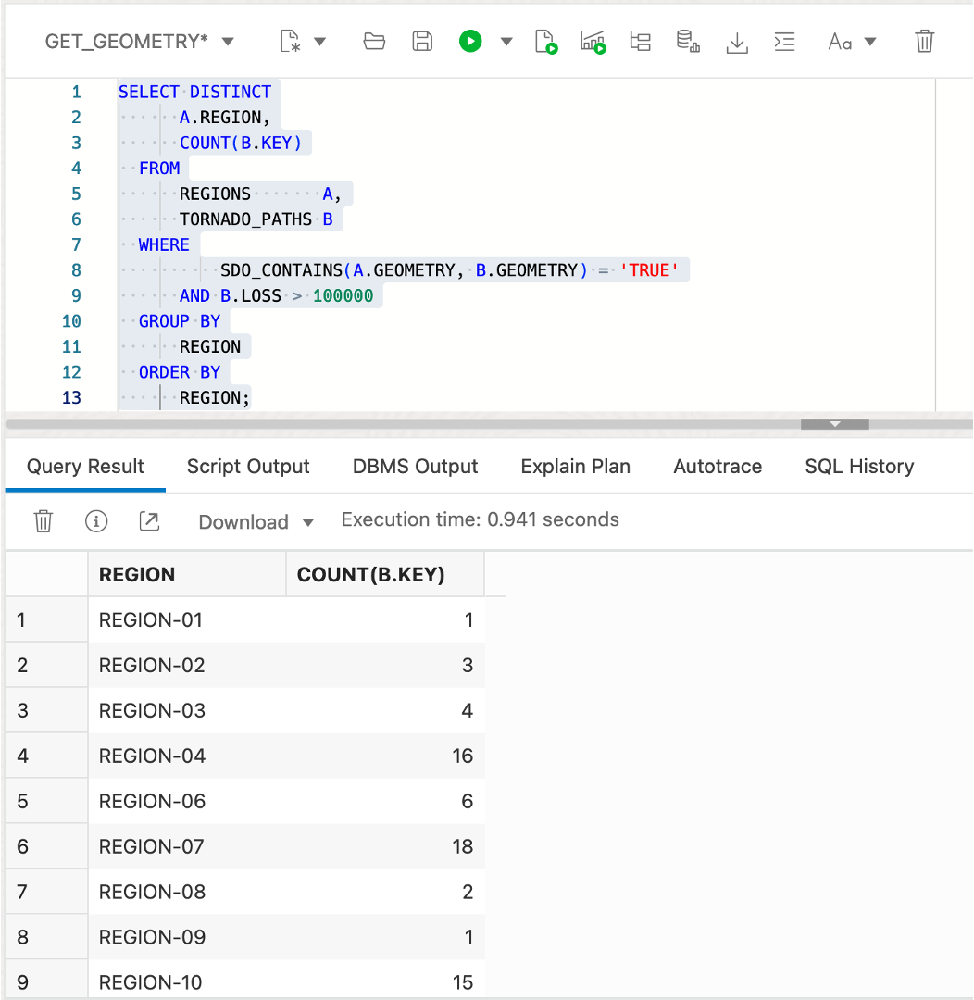

# Spatial queries


## Introduction

This lab walks you through basic spatial queries in Oracle Autonomous Database. You will use the sample data created in the previous lab to identify items based on proximity and containment.

Estimated Time: 20 minutes

Watch the video below for a quick walk-through of the lab.
[Prepare spatial data](videohub:1_feaq2eu8)

### Objectives

In this lab, you will:
*  Learn about and perform spatial queries in Oracle Database

### Prerequisites

* Completion of Lab 3: Prepare spatial data


### About spatial queries

Oracle Database includes a robust library of functions and operators for spatial analysis. This includes spatial relationships, measurements, aggregations, transformations, and more. These operations are accessible through native SQL, PL/SQL, Java APIs, and any other languages with connection modules to Oracle such as Python and Node.js.

The most common operations are Spatial Operators which perform spatial filtering and joining, and Spatial Functions which perform calculation and transformations.

Spatial Operators test for a spatial relationship, such as INSIDE or WITHIN\_DISTANCE and return 'TRUE' when the relationship exists. Spatial Operators are used in the WHERE clause of a query. Generically as follows:

```
<code>
SELECT [fields]
FROM [tables]
WHERE [Spatial Operator]='TRUE'
AND [other conditions...]
</code>
```

For example, to identify items in MY\_POINTS that are inside REGION-01 of MY\_REGIONS:

```
<code>
SELECT *
FROM MY_POINTS A, MY_REGIONS B
WHERE SDO_INSIDE(A.GEOMETRY, B.GEOMETRY) = 'TRUE'
AND B.NAME='MY_REGION-01';
</code>
```

Spatial Functions return a value and can be in the SELECT list or used in the WHERE clause. Generically as follows:

```
<code>
SELECT [Spatial Function], [other fields...]
FROM [tables]
WHERE [conditions]
</code>
```
 
For example, to get the area of REGION-01 of MY\_REGIONS:

```
<code>
SELECT SDO_GEOM.SDO_AREA(GEOMETRY)
FROM MY_REGIONS
WHERE NAME='MY_REGION-01';
</code>
```

There are hundreds of Spatial SQL and PL/SQL operations available, as documented [here](https://docs.oracle.com/en/database/oracle/oracle-database/19/spatl/spatial-reference-information.html). You will explore some of the most common ones in this lab.

### Objectives

In this lab, you will perform spatial queries to identify the location relationships between stores, warehouses, regions, and tornado paths.


### Prerequisites

* Completion of Lab 3: Prepare Spatial Data

<!--  *This is the "fold" - below items are collapsed by default*  -->


## Task 1: Proximity queries 

Proximity relates to how close items are to each other. The two main Spatial proximity operators are 
* SDO\_WITH\_DISTANCE( ) returns items within a given distance of another item
* SDO\_NN( ) returns the nearest items to another item.

1. Begin by identifying stores within 20 miles of the Dallas Warehouse using **SDO\_WITHIN\_DISTANCE( )**. Notice that the first argument to **SDO\_WITHIN\_DISTANCE( )** is the function that returns geometry for STORES (instead of a geometry column). You are able to use this since you created an associated function-based spatial index.

      ```
      <copy> 
       SELECT
           STORE_NAME,
           STORE_TYPE
       FROM
           STORES     A,
           WAREHOUSES B
       WHERE
            B.WAREHOUSE_NAME = 'Dallas Warehouse'
       AND SDO_WITHIN_DISTANCE(
             GET_GEOMETRY(A.LONGITUDE, A.LATITUDE),
             B.GEOMETRY,
             'distance=20 unit=mile') = 'TRUE'
     </copy>
     ```

   

2. Identifying items nearest to another item is accomplished with the Spatial operator **SDO\_NN( )**, where NN stands for Nearest Neighbor. Run the following query to identify the 5 closest stores to the Dallas Warehouse. Again, notice that the first argument to **SDO\_NN( )** is the function that returns geometry, which has a function-based spatial index.

      ```
      <copy> 
       SELECT
            STORE_NAME,
            STORE_TYPE
        FROM
            STORES     A,
            WAREHOUSES B
        WHERE B.WAREHOUSE_NAME = 'Dallas Warehouse'
         AND SDO_NN(
              GET_GEOMETRY(A.LONGITUDE, A.LATITUDE),
              B.GEOMETRY,
              'sdo_batch_size=10') = 'TRUE'
       AND ROWNUM <= 5;
     </copy>
     ```

   

3. The **SDO\_NN( )** operator allows you to include distance. Run the following query to return the 5 closest stores to the Dallas Warehouse along with their distances in miles.

      ```
      <copy> 
       SELECT
            STORE_NAME,
            STORE_TYPE,
            ROUND( SDO_NN_DISTANCE(1) , 2) DISTANCE_MI
        FROM
            STORES     A,
            WAREHOUSES B
        WHERE B.WAREHOUSE_NAME = 'Dallas Warehouse'
         AND SDO_NN(
              GET_GEOMETRY(A.LONGITUDE, A.LATITUDE),
              B.GEOMETRY,
              'sdo_batch_size=10 unit=MILE', 1) = 'TRUE'
       AND ROWNUM <= 5;
     </copy>
     ```

   


4. Run the following query to return the 5 closest retail stores to the Dallas Warehouse along with their distances in miles. Notice that the result includes stores farther than the previous result since you re only looking for retail stores.

      ```
      <copy> 
       SELECT
            STORE_NAME,
            STORE_TYPE,
            ROUND( SDO_NN_DISTANCE(1) , 2) DISTANCE_MI
        FROM
            STORES     A,
            WAREHOUSES B
        WHERE B.WAREHOUSE_NAME = 'Dallas Warehouse'
        AND A.STORE_TYPE='RETAIL'
         AND SDO_NN(
              GET_GEOMETRY(A.LONGITUDE, A.LATITUDE),
              B.GEOMETRY,
              'sdo_batch_size=10 unit=MILE', 1) = 'TRUE'
       AND ROWNUM <= 5;
     </copy>
     ```
   

4. Spatial operators such as SDO\_NN( ) can also be used to create a join. Run the following query to return each store with the name of the nearest warehouse. 

     ```
     <copy> 
       SELECT a.store_name, b.warehouse_name
       FROM stores a,warehouses b
       WHERE SDO_NN(b.geometry,
               get_geometry(a.longitude,a.latitude), 
               'sdo_num_res=1') = 'TRUE';
     </copy>
     ```

  

4. Run the following query to return each store with the name of the nearest warehouse along with the distances in miles. 

     ```
     <copy> 
       SELECT
           A.STORE_NAME,
           B.WAREHOUSE_NAME,
           ROUND( SDO_NN_DISTANCE(1) , 2) DISTANCE_MI
       FROM
           STORES     A,
           WAREHOUSES B
       WHERE
           SDO_NN(B.GEOMETRY,
                  GET_GEOMETRY(A.LONGITUDE, A.LATITUDE),
                  'sdo_num_res=1 unit=MILE', 1) = 'TRUE';
     </copy>
     ```

 

4. Proximity is useful for aggregate analysis. Run the following query to return the number of tornados and maximum loss within 20 miles of the Dallas Warehouse.

    ```
    <copy> 
       SELECT
           COUNT(A.KEY),
           MAX(A.LOSS)
       FROM
           TORNADO_PATHS A,
           WAREHOUSES B
       WHERE
           B.WAREHOUSE_NAME = 'Dallas Warehouse'
        AND SDO_WITHIN_DISTANCE( A.GEOMETRY,
                                 B.GEOMETRY,
              'distance=20 unit=mile') = 'TRUE'
    </copy>
      ```

      

   1. Returning to the use of Spatial operators for joins, run the following query to return each warehouse with the number of tornados and maximum loss within 20 miles.

    ```
    <copy> 
       SELECT
           B.WAREHOUSE_NAME,
           COUNT(A.KEY),
           MAX(A.LOSS)
       FROM
           TORNADO_PATHS A,
           WAREHOUSES B
       WHERE SDO_WITHIN_DISTANCE( A.GEOMETRY,
                                 B.GEOMETRY,
              'distance=20 unit=mile') = 'TRUE'
       GROUP BY B.WAREHOUSE_NAME;  
    </copy>
      ```

   

  Increase the distance value in the query from 20 to 50 mi and observe the new result.


## Task 2: Containment queries 

Containment refers to identifying items that are contained by a specific region, and vice versa, identifying regions that contain specific items. The spatial main Spatial containment operators are 
 * SDO\_INSIDE( ) returns items that are inside region(s). Items on the boundary are not returned.
 * SDO_CONTAINS( ) returns regions that contain item(s). Items on the boundary are not considered to be contained.
 * SDO\_ANYINTERACT( ) returns items having any spatial relationship to other item(s), including items on a boundary or items partially contained such as a line that crosses into a region.


1. Use SDO_INSIDE( ) to return stores in REGION-02, not including stores on the boundary.

      ```
      <copy> 
        SELECT
            A.STORE_NAME,
            A.STORE_TYPE
        FROM
            STORES  A,
            REGIONS B
        WHERE REGION = 'REGION-02'
        AND SDO_INSIDE(
               GET_GEOMETRY(A.LONGITUDE, A.LATITUDE),
               B.GEOMETRY) = 'TRUE';
       </copy>
      ```

      

2. Use SDO_INSIDE( ) to return each store with the region it's contained by. This is another example of using a Spatial operator to perform a join, as you did previously with SDO\_NN( ). Note that stores on a region boundary are not included.  To include stores on the boundary you would use SDO\_ANYINTERACT( ).

      ```
      <copy> 
      SELECT
            A.STORE_NAME,
            A.STORE_TYPE,
            B.REGION
        FROM
            STORES  A,
            REGIONS B
        WHERE SDO_INSIDE(
              GET_GEOMETRY(A.LONGITUDE, A.LATITUDE),
              B.GEOMETRY) = 'TRUE';
       </copy>
      ```

      


3. Next use SDO\_ANYINTERACT( ) for the purpose of aggregation of tornadoes by region. Run the following to return the number of tornadoes and maximum loss for each region. Note that SDO\_ANYINTERACT( ) returns items having any spatial relationship such as tornado paths that are entirely or partially contained by a region.

      ```
      <copy> 
      SELECT
          B.REGION,
          COUNT(*),
          MAX(LOSS)
      FROM
          TORNADO_PATHS A,
          REGIONS       B
      WHERE
          SDO_ANYINTERACT(A.GEOMETRY, B.GEOMETRY) = 'TRUE'
      GROUP BY
          REGION
      ORDER BY
          REGION;
      </copy>
      ```

      


4. Identify regions containing tornado(s) with loss above $100,000.

      ```
      <copy> 
        SELECT DISTINCT
            A.REGION
        FROM
            REGIONS       A,
            TORNADO_PATHS B
        WHERE
               SDO_CONTAINS(A.GEOMETRY, B.GEOMETRY) = 'TRUE'
        AND 
               B.LOSS > 100000
        ORDER BY
            REGION;
      </copy>
      ```

      

5. Identify regions containing tornado(s) with loss above $100,000 along with the total number of tornadoes.

      ```
      <copy> 
        SELECT DISTINCT
            A.REGION,
            COUNT(B.KEY)
        FROM
            REGIONS       A,
            TORNADO_PATHS B
        WHERE
                SDO_CONTAINS(A.GEOMETRY, B.GEOMETRY) = 'TRUE'
            AND B.LOSS > 100000
        GROUP BY
            REGION
        ORDER BY
            REGION;
      </copy>
      ```

      

You may now **proceed to the next lab**.


## Learn more

* [Spatial product portal](https://oracle.com/goto/spatial)
* [Spatial documentation](https://docs.oracle.com/en/database/oracle/oracle-database/19/spatl)
* [Spatial blog posts on Oracle Database Insider](https://blogs.oracle.com/database/category/db-spatial)

## Acknowledgements

* **Author** - David Lapp, Database Product Management, Oracle
* **Contributors** - Karin Patenge, Database Product Management, Oracle
* **Last Updated By/Date** - David Lapp, September 2022
