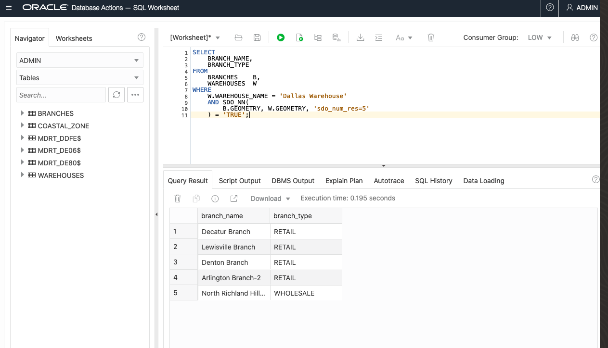
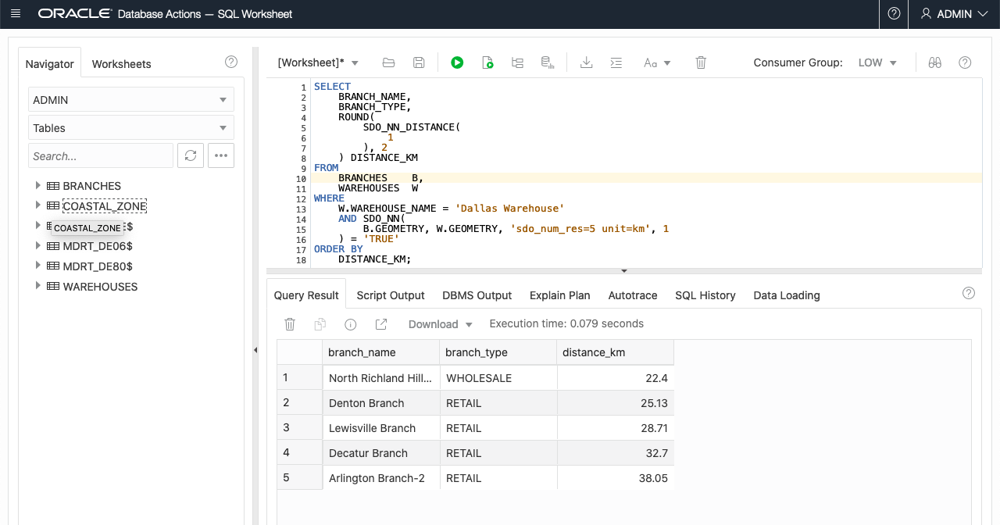
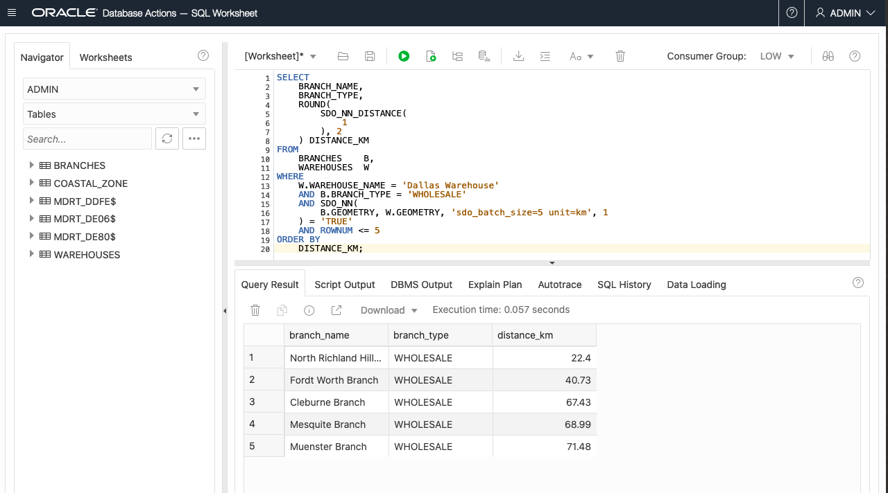
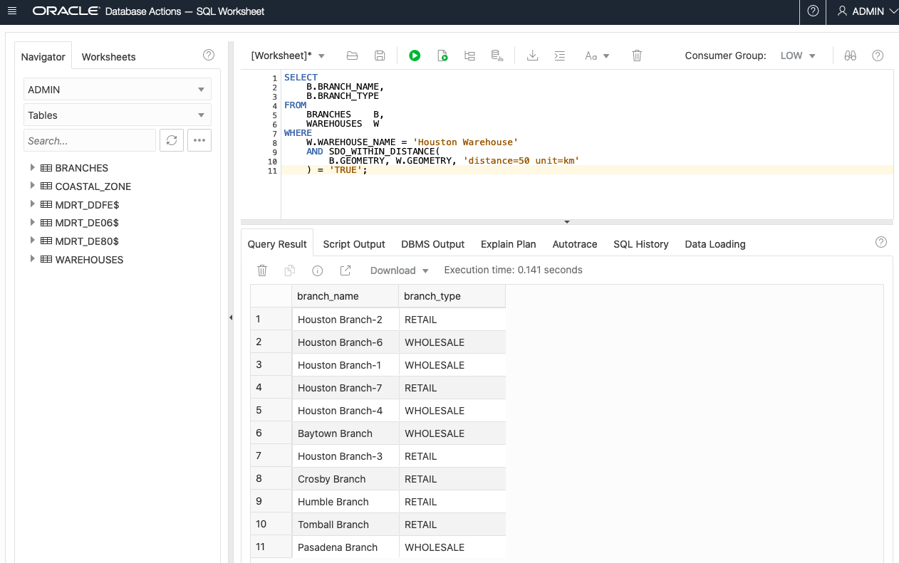
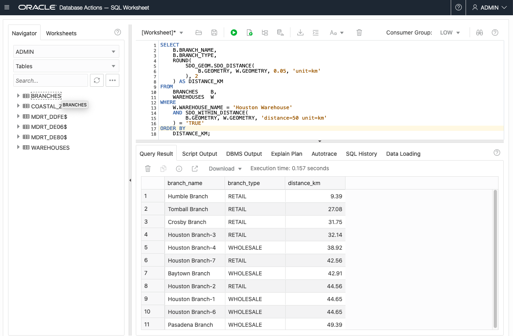
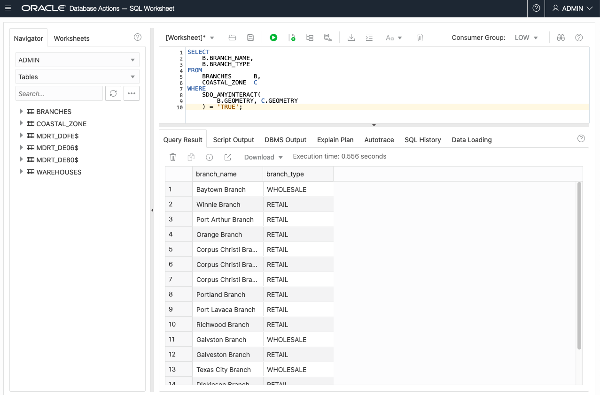
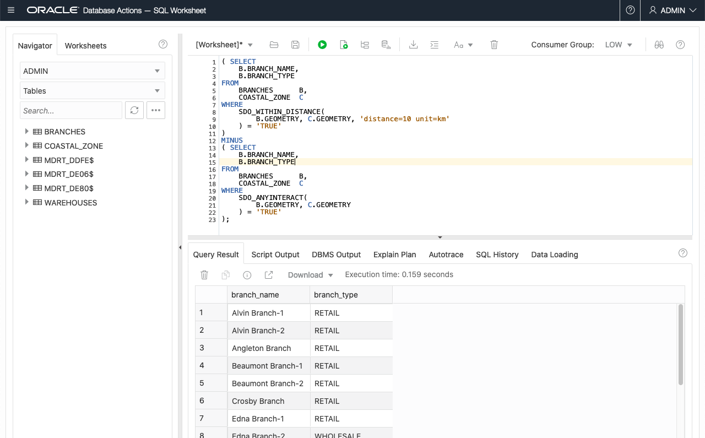

# Spatial Queries

## Introduction

This lab walks you through basic spatial queries in Oracle Database.  You will use the sample data created in the previous lab to identify items based on proximity and containment.

Estimated Lab Time: 15 minutes

### About Spatial Queries
Oracle Database includes a robust library of functions and operators for spatial analysis. This includes spatial relationships, measurements, aggregations, transformations, and much more. These operations are accessible through native SQL, PL/SQL, Java APIs, and any other language that communicates with Oracle Database.

### Objectives

In this lab, you will:
* Identify BRANCHES having proximity relationships to a WAREHOUSE
* Identify BRANCHES having containment and proximity relationships to a COASTAL_ZONE

### Prerequisites


* Completion of previous lab; Create Sample Spatial Data

<!--  *This is the "fold" - below items are collapsed by default*  -->


## Spatial Queries 

Spatial queries in Oracle Database are just like any other traditional queries you are accustomed to. The only difference is a set of spatial functions and operators that are probably new to you.

**Identify 5 closest branches to the the Dallas Warehouse:**
```
<copy> 
SELECT
    BRANCH_NAME,
    BRANCH_TYPE
FROM
    BRANCHES    B,
    WAREHOUSES  W
WHERE
    W.WAREHOUSE_NAME = 'Dallas Warehouse'
    AND SDO_NN(
        B.GEOMETRY, W.GEOMETRY, 'sdo_num_res=5'
    ) = 'TRUE';
</copy>
```

Notes:
    
* The ```SDO_NN``` operator returns the 'n nearest' branches to the Dallas Warehouse, where 'n' is the value specificed for ```SDO_NUM_RES```. The first argument to ```SDO_NN``` (```B.GEOMETRY``` in the example above) is the column to search. The second argument (```W.GEOMETRY``` in the example above) is the location you want to find the neighbors nearest to. No assumptions should be made about the order of the returned results. For example, the first row returned is not guaranteed to be the closest. If two or more branches are an equal distance from the warehouse, then either may be returned on subsequent calls to ```SDO_NN```.
* When using the ```SDO_NUM_RES``` parameter, no other criteria are used in the ```WHERE``` clause. ```SDO_NUM_RES``` takes only proximity into account. For example, if you added a criterion to the ```WHERE``` clause because you wanted the five closest branches having a specific zipcode, and four of the five closest branches have a different zipcode, the query above would return one row. This behavior is specific to the ```SDO_NUM_RES``` parameter. In an query below you will use an alternative parameter for the scenario of additional query criteria. 


**Identify 5 closest branches to the the Dallas Warehouse with distance:**
```
<copy>
SELECT
    BRANCH_NAME,
    BRANCH_TYPE,
    ROUND(
        SDO_NN_DISTANCE(
            1
        ), 2
    ) DISTANCE_KM
FROM
    BRANCHES    B,
    WAREHOUSES  W
WHERE
    W.WAREHOUSE_NAME = 'Dallas Warehouse'
    AND SDO_NN(
        B.GEOMETRY, W.GEOMETRY, 'sdo_num_res=5 unit=km', 1
    ) = 'TRUE'
ORDER BY
    DISTANCE_KM;
</copy>
```

Notes:

* The ```SDO_NN_DISTANCE``` operator is an ancillary operator to the ```SDO_NN``` operator; it can only be used within the ```SDO_NN``` operator. The argument for this operator is a number that matches the number specified as the last argument of ```SDO_NN```; in this example it is 1. There is no hidden meaning to this argument, it is simply a tag. If ```SDO_NN_DISTANCE()``` is specified, you can order the results by distance and guarantee that the first row returned is the closest. If the data you are querying is stored as longitude and latitude, the default unit for ```SDO_NN_DISTANCE``` is meters.
* The ```SDO_NN``` operator also has a ```UNIT``` parameter that determines the unit of measure returned by ```SDO_NN_DISTANCE```.
* The ```ORDER BY DISTANCE``` clause ensures that the distances are returned in order, with the shortest distance first.


**Identify 5 closest WHOLESALE branches to the the Dallas Warehouse with distance:**
```
<copy>
SELECT
    BRANCH_NAME,
    BRANCH_TYPE,
    ROUND(
        SDO_NN_DISTANCE(
            1
        ), 2
    ) DISTANCE_KM
FROM
    BRANCHES    B,
    WAREHOUSES  W
WHERE
    W.WAREHOUSE_NAME = 'Dallas Warehouse'
    AND B.BRANCH_TYPE = 'WHOLESALE'
    AND SDO_NN(
        B.GEOMETRY, W.GEOMETRY, 'sdo_batch_size=5 unit=km', 1
    ) = 'TRUE'
    AND ROWNUM <= 5
ORDER BY
    DISTANCE_KM;
</copy>
```


Notes:
* ```SDO_BATCH_SIZE``` is a tunable parameter that may affect your query's performance. ```SDO_NN``` internally calculates that number of distances at a time. The initial batch of rows returned may not satisfy the constraints in the WHERE clause, so the number of rows specified by ```SDO_BATCH_SIZE``` is continuously returned until all the constraints in the WHERE clause are satisfied. You should choose a ```SDO_BATCH_SIZE``` that initially returns the number of rows likely to satisfy the constraints in your WHERE clause.
* The ```UNIT``` parameter used within the ```SDO_NN``` operator specifies the unit of measure of the ```SDO_NN_DISTANCE``` parameter. The default unit is the unit of measure associated with the data. For longitude and latitude data, the default is meters.
* ```B.BRANCH_TYPE = 'WHOLESALE' AND ROWNUM <= 5``` are the additional constraints in the ```WHERE``` clause. The rownum  clause is necessary to limit the number of results returned to 5.
* The ```ORDER BY DISTANCE_KM``` clause ensures that the distances are returned in order, with the shortest distance first and the distances measured in miles.

**Identify branches within 50km of Houston Warehouse:**
```
<copy>
SELECT
    B.BRANCH_NAME,
    B.BRANCH_TYPE
FROM
    BRANCHES    B,
    WAREHOUSES  W
WHERE
    W.WAREHOUSE_NAME = 'Houston Warehouse'
    AND SDO_WITHIN_DISTANCE(
        B.GEOMETRY, W.GEOMETRY, 'distance=50 unit=km'
    ) = 'TRUE';
</copy>
```

Notes:
* The first argument to ```SDO_WITHIN_DISTANCE``` is the column to search. The second argument is the location you want to determine the distances from. No assumptions should be made about the order of the returned results. For example, the first row returned is not guaranteed to be the customer closest to warehouse 3.
* The DISTANCE parameter used within the ```SDO_WITHIN_DISTANCE``` operator specifies the distance value; in this example it is 100.
* The UNIT parameter used within the ```SDO_WITHIN_DISTANCE``` operator specifies the unit of measure of the DISTANCE parameter. The default unit is the unit of measure associated with the data. For longitude and latitude data, the default is meters; in this example, it is miles.


**Identify branches within 50km of Houston Warehouse with distance:**

```
<copy>
SELECT
    B.BRANCH_NAME,
    B.BRANCH_TYPE,
    ROUND(
        SDO_GEOM.SDO_DISTANCE(
            B.GEOMETRY, W.GEOMETRY, 0.05, 'unit=km'
        ), 2
    ) AS DISTANCE_KM
FROM
    BRANCHES    B,
    WAREHOUSES  W
WHERE
    W.WAREHOUSE_NAME = 'Houston Warehouse'
    AND SDO_WITHIN_DISTANCE(
        B.GEOMETRY, W.GEOMETRY, 'distance=50 unit=km'
    ) = 'TRUE'
ORDER BY
    DISTANCE_KM;
</copy>
```

Notes:
* The ```SDO_GEOM.SDO_DISTANCE``` function computes the distance between branch locations and the Houston Warehouse. 
* The first 2 arguments to ```SDO_GEOM.SDO_DISTANCE``` are BRANCH and WAREHOUSE locations for distance computation.
* The third argument to ```SDO_GEOM.SDO_DISTANCE ``` is the tolerance value. The tolerance is a round-off error value used by Oracle Spatial. The tolerance is in meters for longitude and latitude data. In this example, the tolerance is 50 mm.
* The UNIT parameter used within the ```SDO_GEOM.SDO_DISTANCE``` parameter specifies the unit of measure of the distance computed by the ```SDO_GEOM```.```SDO_DISTANCE``` function. The default unit is the unit of measure associated with the data. For longitude and latitude data, the default is meters. In this example it is miles.
* The ```ORDER BY DISTANCE_IN_MILES``` clause ensures that the distances are returned in order, with the shortest distance first and the distances measured in miles.


**Identify branches in the coastal zone:**

```
<copy>
SELECT
    B.BRANCH_NAME,
    B.BRANCH_TYPE
FROM
    BRANCHES      B,
    COASTAL_ZONE  C
WHERE
    SDO_ANYINTERACT(
        B.GEOMETRY, C.GEOMETRY
    ) = 'TRUE';
</copy>
```

Notes:
* The ```SDO_ANYINTERACT``` operator accepts 2 arguments, geometry1 and geometry2. The operator returns ```TRUE``` for rows where geometry1 is inside or on the boundary of geometry2.
* In this example geometry1 is ```B.GEOMETRY```, the branch geometries, and geometry2 is ```C.GEOMETRY```, the coastal zone geometry. The COASTAL_ZONE table has only 1 row so no additional criteria is needed.

**Identify branches outside and within 10km of coastal zone:**

```
<copy>

( SELECT
    B.BRANCH_NAME,
    B.BRANCH_TYPE
FROM
    BRANCHES      B,
    COASTAL_ZONE  C
WHERE
    SDO_WITHIN_DISTANCE(
        B.GEOMETRY, C.GEOMETRY, 'distance=10 unit=km'
    ) = 'TRUE'
)
MINUS
( SELECT
    B.BRANCH_NAME,
    B.BRANCH_TYPE
FROM
    BRANCHES      B,
    COASTAL_ZONE  C
WHERE
    SDO_ANYINTERACT(
        B.GEOMETRY, C.GEOMETRY
    ) = 'TRUE'
);
</copy>
```

Notes:
* In the first part of this query, the ```SDO_WITHIN_DISTANCE``` operator identifies BRANCHES within 10 km of the COASTAL_ZONE. This includes BRANCHES inside the COASTAL\_ZONE.
* The query uses ```MINUS``` to remove BRANCHES inside the COASTAL_ZONE, leaving only BRACNCHES within 10km and outside the COASTAL\_ZONE. 

## Learn More
* [Spatial product portal] (https://oracle.com/goto/spatial)
* [Spatial documention](https://docs.oracle.com/en/database/oracle/oracle-database/19/spatl)
* [Spatial blogs](https://blogs.oracle.com/oraclespatial/)

## Acknowledgements
* **Author** - David Lapp, Database Product Management, Oracle
*  **Last Updated By/Date** - Kamryn Vinson, November 2020


