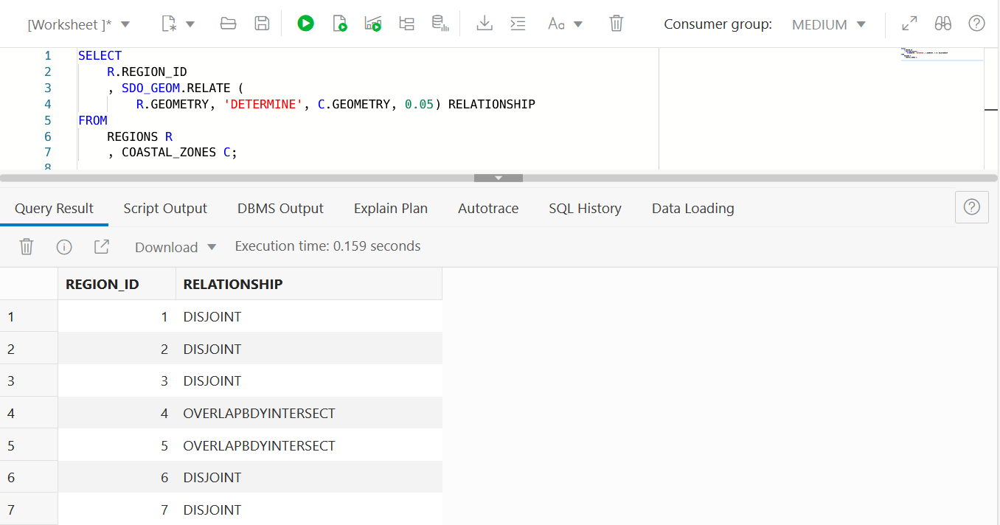

# Spatial Queries


## Introduction

This lab walks you through basic spatial queries in Oracle Database. You will use the sample data created in the previous lab to identify items based on proximity and containment.

Estimated Lab Time: 30 minutes


### About Spatial Queries

Oracle Database includes a robust library of functions and operators for spatial analysis. This includes spatial relationships, measurements, aggregations, transformations, and much more. These operations are accessible through native SQL, PL/SQL, Java APIs, and any other lan


### Objectives

In this lab, you will:
* Identify stores having proximity relationships to a warehouse
* Identify stores having containment and proximity relationships to the coastal zone
* Identify regions having a spatial relationship with the coastal zone
* Compute a minimum distance matrix for warehouses and stores
* Create buffers around earthquake locations with diameters related to the magnitude
* Identify stores that are potentially affected by earthquakes 
    + using the buffers created before
    + using a colocation function
* Aggregate stores per region and group them by store type
* Compute the centroid of each region
* Cluster earthquakes including outlying values


### Prerequisites

* Completion of previous lab; Create Sample Spatial Data

<!--  *This is the "fold" - below items are collapsed by default*  -->


## Spatial Queries 

Spatial queries in Oracle Database are just like any other traditional queries you are accustomed to. The only difference is a set of spatial functions and operators that are probably new to you.

**Query 1: Identify the 5 closest STORES to the Dallas WAREHOUSE:**

```
<copy> 
SELECT
    STORE_NAME
    , STORE_TYPE
FROM
    STORES B
    , WAREHOUSES W
WHERE
    W.WAREHOUSE_NAME = 'Dallas Warehouse'
    AND SDO_NN(
        B.GEOMETRY, W.GEOMETRY, 'sdo_num_res=5'
    ) = 'TRUE';
</copy>
```


Notes: 
* The ```SDO_NN``` operator returns the 'n nearest' STORES to the Dallas Warehouse, where 'n' is the value specificed for ```SDO_NUM_RES```. The first argument to ```SDO_NN``` (```B.GEOMETRY``` in the example above) is the column to search. The second argument (```W.GEOMETRY``` in the example above) is the location you want to find the neighbors nearest to. No assumptions should be made about the order of the returned results. For example, the first row returned is not guaranteed to be the closest. If two or more STORES are an equal distance from the warehouse, then either may be returned on subsequent calls to ```SDO_NN```.
* When using the ```SDO_NUM_RES``` parameter, no other criteria are used in the ```WHERE``` clause. ```SDO_NUM_RES``` takes only proximity into account. For example, if you added a criterion to the ```WHERE``` clause because you wanted the five closest STORES having a specific zipcode, and four of the five closest STORES have a different zipcode, the query would return only one row. This behavior is specific to the ```SDO_NUM_RES``` parameter. In the following query you will include a distance operator to return the actual distances for the 5 nearest stores. 


**Query 2: Identify the 5 closest STORES to the Dallas Warehouse with distance:**
```
<copy>
SELECT
    STORE_NAME
    , STORE_TYPE
    , ROUND(SDO_NN_DISTANCE(1), 2) DISTANCE_KM
FROM
    STORES B
    , WAREHOUSES W
WHERE
    W.WAREHOUSE_NAME = 'Dallas Warehouse'
    AND SDO_NN(
        B.GEOMETRY, W.GEOMETRY, 'sdo_num_res=5 unit=km', 1
    ) = 'TRUE'
ORDER BY
    DISTANCE_KM;
</copy>
```


Notes:
* The ```SDO_NN_DISTANCE``` operator is an ancillary operator to the ```SDO_NN``` operator; it can only be used within the ```SDO_NN``` operator. The argument for this operator is a number that matches the number specified as the last argument of ```SDO_NN```; in this example it is 1. There is no hidden meaning to this argument, it is simply a tag. If ```SDO_NN_DISTANCE()``` is specified, you can order the results by distance and guarantee that the first row returned is the closest. If the data you are querying is stored as longitude and latitude, the default unit for ```SDO_NN_DISTANCE``` is meters.
* The ```SDO_NN``` operator also has a ```UNIT``` parameter that determines the unit of measure returned by ```SDO_NN_DISTANCE```.
* The ```ORDER BY DISTANCE``` clause ensures that the distances are returned in order, with the shortest distance first.


**Query 3: Identify the 5 closest STORES of type WHOLESALE to the Dallas WAREHOUSE with distance:**

```
<copy>
SELECT
    STORE_NAME
    , STORE_TYPE
    , ROUND(SDO_NN_DISTANCE(1), 2) DISTANCE_KM
FROM
    STORES B
    , WAREHOUSES W
WHERE
    W.WAREHOUSE_NAME = 'Dallas Warehouse'
    AND B.STORE_TYPE = 'WHOLESALE'
    AND SDO_NN(
        B.GEOMETRY, W.GEOMETRY, 'sdo_batch_size=5 unit=km', 1
    ) = 'TRUE'
    AND ROWNUM <= 5
ORDER BY
    DISTANCE_KM;
</copy>
```


Notes:
* ```SDO_BATCH_SIZE``` is a tunable parameter that may affect your query's performance. ```SDO_NN``` internally calculates that number of distances at a time. The initial batch of rows returned may not satisfy the constraints in the WHERE clause, so the number of rows specified by ```SDO_BATCH_SIZE``` is continuously returned until all the constraints in the WHERE clause are satisfied. You should choose a ```SDO_BATCH_SIZE``` that initially returns the number of rows likely to satisfy the constraints in your WHERE clause.
* The ```UNIT``` parameter used within the ```SDO_NN``` operator specifies the unit of measure of the ```SDO_NN_DISTANCE``` parameter. The default unit is the unit of measure associated with the data. For longitude and latitude data, the default is meters.
* ```B.STORE_TYPE = 'WHOLESALE' AND ROWNUM <= 5``` are the additional constraints in the ```WHERE``` clause. The rownum  clause is necessary to limit the number of results returned to 5.
* The ```ORDER BY DISTANCE_KM``` clause ensures that the distances are returned in order, with the shortest distance first and the distances measured in kilometers.


**Query 4: Search for all STORES within 50km of Houston WAREHOUSE:**

```
<copy>
SELECT
    B.STORE_NAME
    , B.STORE_TYPE
FROM
    STORES B
    , WAREHOUSES W
WHERE
    W.WAREHOUSE_NAME = 'Houston Warehouse'
    AND SDO_WITHIN_DISTANCE(
        B.GEOMETRY, W.GEOMETRY, 'distance=50 unit=km'
    ) = 'TRUE';
</copy>
```


Notes:
* The first argument to ```SDO_WITHIN_DISTANCE``` is the column to search. The second argument is the location you want to determine the distances from. No assumptions should be made about the order of the returned results. For example, the first row returned is not guaranteed to be the customer closest to warehouse 3.
* The DISTANCE parameter used within the ```SDO_WITHIN_DISTANCE``` operator specifies the distance value; in this example it is 100.
* The UNIT parameter used within the ```SDO_WITHIN_DISTANCE``` operator specifies the unit of measure of the DISTANCE parameter. The default unit is the unit of measure associated with the data. For longitude and latitude data, the default is meters; in this example, it is miles.


**Query 5: Search for all STORES within 50km of Houston WAREHOUSE with distance:**

```
<copy>
SELECT
    B.STORE_NAME
    , B.STORE_TYPE
    , ROUND(
        SDO_GEOM.SDO_DISTANCE(
            B.GEOMETRY, W.GEOMETRY, 0.05, 'unit=km'
        ), 2
    ) AS DISTANCE_KM
FROM
    STORES B
    , WAREHOUSES  W
WHERE
    W.WAREHOUSE_NAME = 'Houston Warehouse'
    AND SDO_WITHIN_DISTANCE(
        B.GEOMETRY, W.GEOMETRY, 'distance=50 unit=km'
    ) = 'TRUE'
ORDER BY
    DISTANCE_KM;
</copy>
```


Notes:
* The ```SDO_GEOM.SDO_DISTANCE``` function computes the distance between branch locations and the Houston Warehouse. 
* The first 2 arguments to ```SDO_GEOM.SDO_DISTANCE``` are BRANCH and WAREHOUSE locations for distance computation.
* The third argument to ```SDO_GEOM.SDO_DISTANCE ``` is the tolerance value. The tolerance is a round-off error value used by Oracle Spatial. The tolerance is in meters for longitude and latitude data. In this example, the tolerance is 50 mm.
* The UNIT parameter used within the ```SDO_GEOM.SDO_DISTANCE``` parameter specifies the unit of measure of the distance computed by the ```SDO_GEOM```.```SDO_DISTANCE``` function. The default unit is the unit of measure associated with the data. For longitude and latitude data, the default is meters. In this example it is miles.
* The ```ORDER BY DISTANCE_IN_MILES``` clause ensures that the distances are returned in order, with the shortest distance first and the distances measured in miles.


**Query 6: Search for all STORES in the COASTAL ZONE:**

```
<copy>
SELECT
    B.STORE_NAME
    , B.STORE_TYPE
FROM
    STORES B
    , COASTAL_ZONES C
WHERE
    SDO_ANYINTERACT(
        B.GEOMETRY, C.GEOMETRY
    ) = 'TRUE';
</copy>
```


Notes:
* The ```SDO_ANYINTERACT``` operator accepts 2 arguments, geometry1 and geometry2. The operator returns ```TRUE``` for rows where geometry1 is inside or on the boundary of geometry2.
* In this example geometry1 is ```B.GEOMETRY```, the branch geometries, and geometry2 is ```C.GEOMETRY```, the coastal zone geometry. The COASTAL_ZONES table has only 1 row so no additional criteria is needed.


**Query 7: Search for all STORES outside and within 10km of the COASTAL ZONE:**

```
<copy>
SELECT
    B.STORE_NAME
    , B.STORE_TYPE
FROM
    STORES B
    , COASTAL_ZONES C
WHERE
    SDO_WITHIN_DISTANCE(
        B.GEOMETRY, C.GEOMETRY, 'distance=10 unit=km'
    ) = 'TRUE'
MINUS
SELECT
    B.STORE_NAME
    , B.STORE_TYPE
FROM
    STORES B
    , COASTAL_ZONES C
WHERE
    SDO_ANYINTERACT(
        B.GEOMETRY, C.GEOMETRY
    ) = 'TRUE';
</copy>
```


Notes:
* In the first part of this query, the ```SDO_WITHIN_DISTANCE``` operator identifies STORES within 10km of the COASTAL ZONE. This includes STORES inside the COASTAL ZONE.
* The query uses ```MINUS``` to remove STORES inside the COASTAL ZONE, leaving only STORES within 10km and outside the COASTAL ZONE. 


**Query 8: Determine the topological relationship between all REGIONS and the COASTAL ZONE:**

```
<copy>
SELECT
    R.REGION_ID
    , SDO_GEOM.RELATE (
        R.GEOMETRY, 'DETERMINE', C.GEOMETRY, 0.05
    ) RELATIONSHIP
FROM
    REGIONS R
    , COASTAL_ZONES C;
</copy>
```



Notes:
* The ```SDO_GEOM.RELATE``` function uses a nine-intersection model for categorizing
binary topological relationships between geometries (points, lines, and polygons). Each geometry has an interior, a boundary, and an exterior. Following relationships can be returned: 


* Using the keyword ```DETERMINE``` as second argument, the function returns the one relationship that best matches the geometries.
* The fourth argument is the tolerance value.


**Query 9: Compute a minimum distance matrix for warehouses and stores**

```
<copy>
</copy>
```


**Query 10: Create buffers around earthquake locations with diameters related to their magnitude**

```
<copy>
SELECT
    E.ID
    , E.TIME
    , E.MAG
    , E.EQTYPE
    , E.PLACE
    , E.GEOMETRY
    , SDO_GEOM.SDO_BUFFER(E.GEOMETRY, E.MAG*10, 0.05, 'unit=km') BUFFER_GEOMETRY
FROM
    EARTHQUAKES E
WHERE
    UPPER(E.EQTYPE) = 'EARTHQUAKE';
</copy>
```


Note: For details about the meaning of the attributes, see [here](https://earthquake.usgs.gov/data/comcat/).

The result of this query, the earthquake locations and their magnitude-dependent buffers visualized on a map would look like in the following image:


Notes:
* The ```SDO_GEOM.SDO_BUFFER``` function generates a buffer polygon around or inside a geometry object. 
* The first argument defines the geometries for which the buffer is created. 
* The second argument is the size of the buffer around a geometry. Together with the unit specified as fourth argument it results the magnitude value multiplied by 10 in kilometers.
* The third argument is the tolerance value.  


**Query 11: Search for all STORES that were affected by EARTHQUAKES using the BUFFERS created before** 

```
<copy>
WITH BUFFERS AS (
SELECT
    E.ID
    , E.MAG
    , E.PLACE
    , E.TIME
    , SDO_GEOM.SDO_BUFFER(E.GEOMETRY, E.MAG*10, 0.05, 'unit=km') BUFFER_GEOMETRY
FROM
    EARTHQUAKES E
WHERE
    UPPER(E.EQTYPE) = 'EARTHQUAKE')
SELECT 
    B.TIME
    , S.STORE_NAME
    , B.MAG
    , B.PLACE
FROM 
    STORES S
    , BUFFERS B
WHERE    
    SDO_RELATE(S.GEOMETRY, B.BUFFER_GEOMETRY, 'MASK=ANYINTERACT') = 'TRUE'
ORDER BY
    B.TIME
    , S.STORE_NAME;
</copy>
```


Notes:
* The WITH clause dynamically creates the EARTHQUAKE BUFFERS.
* The ```SDO_RELATE``` operator is used to identify the spatial interaction of STORES with the EARTHQUAKE BUFFERS. 
* The mask ANINTERACT returns TRUE if the two compared geometries are not disjoint.


**Query 12: Search for all stores that are potentially affected by earthquakes using a colocation function** 

```
<copy>

</copy>
```


**Query 13: Aggregate stores per region and group them by store type**

```
<copy>

</copy>
```


**Query 14: Compute the centroid of each region**

```
<copy>

</copy>
```


**Query 15: Create earthquakes clusters including outlying values**

```
<copy>

</copy>
```


## Learn More

* [Spatial product portal](https://oracle.com/goto/spatial)
* [Spatial documentation](https://docs.oracle.com/en/database/oracle/oracle-database/19/spatl)
* [Spatial blog posts on Oracle Database Insider](https://blogs.oracle.com/database/category/db-spatial)
* [Spatial blog posts on Medium.com](https://medium.com/oracledevs/tagged/spatial)


## Acknowledgements

* **Author** - David Lapp, Database Product Management, Oracle
* **Last Updated By/Date** - Karin Patenge, July 2022
