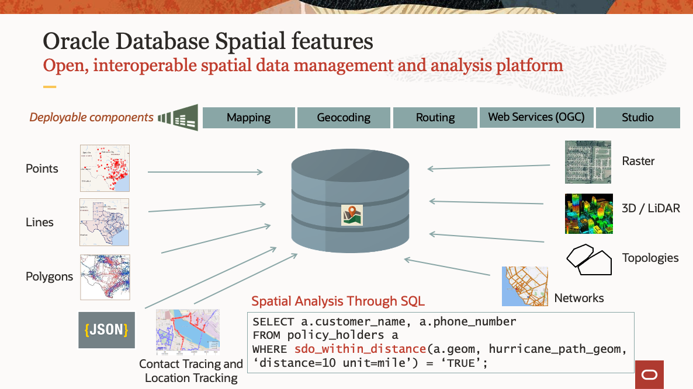

# Introduction

## About Oracle Spatial

Oracle’s mission is to help people see data in new ways, discover insights, and unlock endless possibilities. Spatial analysis is about understanding complex interactions based on geographic relationships – answering questions based on where people, assets, and resources are located. Spatial insights enable you to provide better customer service, optimize your workforce, locate retail and distribution centers, evaluate sales and marketing campaigns, and more. With Oracle’s spatial offerings, developers, database professionals, and analysts can use a comprehensive suite of spatial data management, analytics, and visualization tools to integrate spatial analysis and mapping into applications on enterprise grade data management infrastructure – Oracle Database and Oracle Exadata. Innovative technologies of Oracle Cloud and Oracle Autonomous Database, the industry’s only self-driving, self-securing, and self-repairing database, are available to spatial applications. 

As illustrated below, the spatial features of Oracle Database provide scalable and performant storage, processing and analysis of both basic and advanced spatial data types. A series of deployable Java EE components are also provided to support common mid-tier services. 

  

For more information please visit [https://oracle.com/goto/spatial] (https://oracle.com/goto/spatial)

Estimated Workshop Time: 60 minutes

### Workshop overview

In this workshop you will create, configure, and analyze spatial data.  You will create and configure spatial tables for STORES, WAREHOUSES, REGIONS, and TORNADO\_PATHS from common formats, and then perform spatial queries to explore their relationships based on proximity and containment. You finally transform results using native JSON support in ADB, for developer integration. 

The ability to relate information based on location, such as relating data based on spatial proximity and containment, is extremely valuable in myriad scenarios.  There is no pre-existing key that relates store locations to a warehouse. But Spatial enables such a relationship to be determined based on proximity. Similarly, there is no pre-existing relationship between store locations and regions, for example tax regions. But Spatial enables their relationship to be determined based on containment. Going further, Spatial enables location-based analytics such as summarizing information based on proximity; for example loss due to tornadoes within a distance from a location. Instead of performing these analyses in a separate system, you may leverage the built-in spatial features of ADB.

You will gain experience with all of the aforementioned capabilities in this workshop. 

### Prerequisites

<if type="adb">
- An Oracle Cloud Account 
</if> 
<if type="anydb">
- This workshop requires access to an Oracle Database and SQL client (i.e., SQL Developer, SQL Developer Web, SQL*Plus). 
- If you already have access to these, then following this Introduction you may skip to the section Create Sample Data. 
- Otherwise you should proceed to sections Oracle Cloud Account, Autonomous Database, and SQL Developer Web.
- No previous experience with Oracle Spatial is required.
- An Oracle Cloud Account  
</if>

## Acknowledgements

* **Author** - David Lapp, Database Product Management, Oracle
* **Contributors** - Karin Patenge, Database Product Management, Oracle
* **Last Updated By/Date** - David Lapp, September 2022

